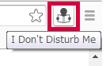
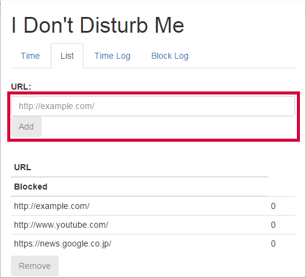
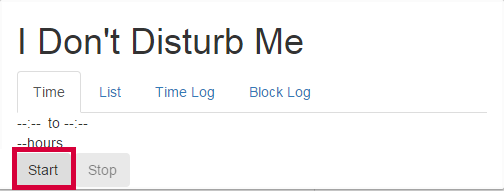

# I Don't Disturb Me

仕事や勉強などの活動をし始めた時刻とし終えた時刻を記録します。活動中には、設定した URL のサイトへのアクセスをブロックします。

## インストール方法
~~"IDontDisturbMe.crx" ファイルをダウンロードして、Chrome ブラウザへドラッグ & ドロップしてください。~~

ソースコードをローカルにダウンロードしてください。次に、 Chrome ブラウザ上で "デベロッパーモード" を使ってパッケージ化されていない拡張機能をローカルファイルから読み込みます。（拡張機能を読み込んだ後は、デベロッパーモードを解除できます）
但し、ローカルから読み込んでいるため Chrome ブラウザの起動ごとに警告メッセージが表示されます。

## 使用方法
### ブロックする URL
1. ブラウザ上のアイコンをクリックして、ポップアップ画面を開きます： 
2. "List" タブへ移動してください。
3. ブロックしたい URL を入力して追加してください： 

### 記録の開始
1. ブラウザ上のアイコンをクリックして、ポップアップ画面を開きます： 
2. "Start" をクリックすると記録を開始します。また、設定された URL へのアクセスをブロックするようになります： 

### Tracking Stop
1. ブラウザ上のアイコンをクリックして、ポップアップ画面を開きます： 
2. "Stop" をクリックすると記録を終了します。また、設定された URL へのアクセスがブロックされなくなります。

