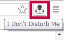
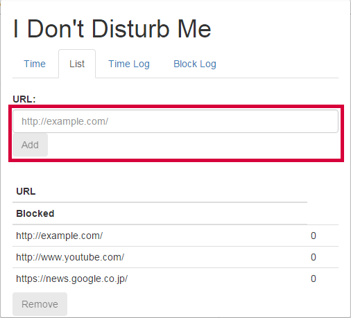

# I Don't Disturb Me

This chrome extension tracks when your activity starts and stops. In addition, during the activity, Site blocker is enabled.

## How to Install
Download "IDontDisturbMe.crx" and drag and drop it to your Chrome browser.

## How to Use
### Blocking URLs
1. Click the icon for this extension to open the pop-up window: 
2. Go to "List" tab.
3. Add URLs which you want this extension to block: 

### Tracking Start
1. Click the icon for this extension to open the pop-up window: 
2. Click the "Start" button to start tracking and blocking configured URLs: 

### Tracking Stop
1. Click the icon for this extension to open the pop-up window: 
2. Click the "Stop" button to stop tracking and blocking configured URLs.
